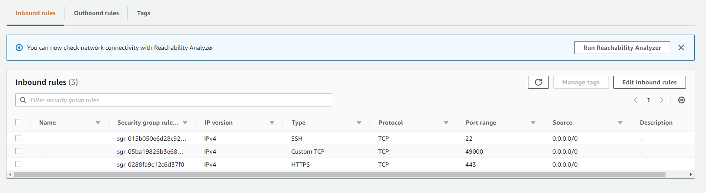

# Catatan

### Menyalakan docker

```
sudo service docker start
```

```
sudo chmod 666 /var/run/docker.sock
```

### Docker Network

```
docker network create submission-dicoding
```

### Docker in docker (dind)

Windows:

```
docker run --name jenkins-docker-submission --detach ^
  --privileged --network submission-dicoding --network-alias docker ^
  --env DOCKER_TLS_CERTDIR=/certs ^
  --volume jenkins-docker-submission-certs:/certs/client ^
  --volume jenkins-data-submission:/var/jenkins_home ^
  --publish 3000:3000 --publish 2376:2376 ^
  docker:dind
```

Linux:

```
docker run --name jenkins-docker-submission --detach \
  --privileged --network submission-dicoding --network-alias docker \
  --env DOCKER_TLS_CERTDIR=/certs \
  --volume jenkins-docker-submission-certs:/certs/client \
  --volume jenkins-data-submission:/var/jenkins_home \
  --publish 3000:3000 --publish 2376:2376 \
  docker:dind
```

### Blueocean

```dockerfile
FROM jenkins/jenkins:2.346.1-jdk11
USER root
RUN apt-get update && apt-get install -y lsb-release
RUN curl -fsSLo /usr/share/keyrings/docker-archive-keyring.asc \
  https://download.docker.com/linux/debian/gpg
RUN echo "deb [arch=$(dpkg --print-architecture) \
  signed-by=/usr/share/keyrings/docker-archive-keyring.asc] \
  https://download.docker.com/linux/debian \
  $(lsb_release -cs) stable" > /etc/apt/sources.list.d/docker.list
RUN apt-get update && apt-get install -y docker-ce-cli
USER jenkins
RUN jenkins-plugin-cli --plugins "blueocean:1.25.5 docker-workflow:1.28"
```

```
docker build -t myjenkins-blueocean:2.346.1-1 .
```

Windows

```
docker run --name jenkins-blueocean-submission --detach ^
  --network submission-dicoding --env DOCKER_HOST=tcp://docker:2376 ^
  --env DOCKER_CERT_PATH=/certs/client --env DOCKER_TLS_VERIFY=1 ^
  --volume jenkins-data-submission:/var/jenkins_home ^
  --volume jenkins-docker-submission-certs:/certs/client:ro ^
  --volume "%HOMEDRIVE%%HOMEPATH%":/home ^
  --restart=on-failure ^
  --env JAVA_OPTS="-Dhudson.plugins.git.GitSCM.ALLOW_LOCAL_CHECKOUT=true" ^
  --publish 49000:8080 --publish 50000:50000 myjenkins-blueocean:2.346.1-1
```

Linux

```
docker run \
  --name jenkins-blueocean-submission \
  --detach \
  --network submission-dicoding \
  --env DOCKER_HOST=tcp://docker:2376 \
  --env DOCKER_CERT_PATH=/certs/client \
  --env DOCKER_TLS_VERIFY=1 \
  --publish 49000:8080 \
  --publish 50000:50000 \
  --volume jenkins-data:/var/jenkins_home \
  --volume jenkins-docker-certs:/certs/client:ro \
  --volume "$HOME":/home \
  --restart=on-failure \
  --env JAVA_OPTS="-Dhudson.plugins.git.GitSCM.ALLOW_LOCAL_CHECKOUT=true" \
  myjenkins-blueocean:2.346.1-1
```

### Inbound Rules pada EC2



### Jenkinsfile

```
node {
    stage('Build') {
        withDockerContainer('python:2-alpine') {
            sh 'python -m py_compile sources/add2vals.py sources/calc.py'
            stash includes: 'sources/*.py*', name: 'compiled-results'
        }
    }
    stage('Test') {
        try {
            withDockerContainer('qnib/pytest') {
                sh 'py.test --junit-xml test-reports/results.xml sources/test_calc.py'
                stash includes: 'sources/*.py*', name: 'compiled-results'
            }
        } catch (e) {
            echo 'Terjadi kesalahan'
            throw e
        } finally {
            junit 'test-reports/results.xml'
        }
    }
    stage('Manual Approval') {
        input 'Lanjutkan ke tahap Deploy?'
    }
    stage('Deploy') {
        withEnv(['VOLUME=$(pwd)/sources:/src', 'IMAGE=cdrx/pyinstaller-linux:python2']) {
            try {
                dir("${env.BUILD_ID}") {
                    unstash 'compiled-results'
                    sh "docker run --rm -v ${VOLUME} ${IMAGE} 'pyinstaller -F add2vals.py'"
                }
            } catch (e) {
                echo 'Terjadi kesalahan'
                throw e
            } finally {
                archiveArtifacts "${env.BUILD_ID}/sources/dist/add2vals"
                sshPublisher(
                    continueOnError: false, failOnError: true,
                    publishers: [
                        sshPublisherDesc(
                            configName: "submission-webserver",
                            transfers: [
                                sshTransfer(
                                    remoteDirectory: '/home/ec2-user',
                                    sourceFiles: "${env.BUILD_ID}/sources/dist/add2vals",
                                    execCommand: "chmod +x ${env.BUILD_ID}/sources/dist/add2vals"
                                )
                            ],
                        )
                    ]
                )
                sh "docker run --rm -v ${VOLUME} ${IMAGE} 'rm -rf build dist'"
                sleep time: 1, unit: 'MINUTES'
            }
        }
    }
}
```

### Credentials:

- username: admin
- password: admin
- e-mail : admin@admin.com

- username: dicoding
- password: dicoding
- e-mail : dicoding@dicoding.com

- submission-cicd-pipeline-djevannn

### Allow User to Sign Up

Manage Jenkins > Configure Global Security > Centang **Allow users to sign up**

### Enable Poll SCM

- Klik salah satu Pipeline
- Pada sidebar klik Configure
- Build Triggers
- Centang **Poll SCM**
- Pada Schedule isikan `H/2 * * * *`
- Klik Save

### Promethus

```
docker run -d --name prometheus-submission -p 9091:9090 prom/prometheus
```

### Grafana

```
docker run -d --name grafana-submission -p 3031:3031 -e "GF_SERVER_HTTP_PORT=3031" grafana/grafana
```

```
scp -i submission-keypair.pem <nama_file> ec2-user@<public_ipv4_dns>:~/.
```

```
scp -i submission-keypair.pem note.txt ec2-user@ec2-18-143-67-105.ap-southeast-1.compute.amazonaws.com:~/.
```
